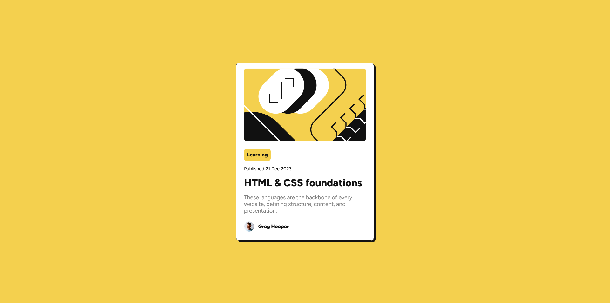

Hey there, here's another project I did mostly by myself. Hope you'll like it.

## What difficulty I faced?
The challenge I'd say that somewhat confused me was to center the whole card in the center of the screen (might be easy for you but I didn't know how to do it?).
That is where I took some help from online sources.
Other than that, all the rest has been done by me using only HTML and CSS.
## Screenshot

## What I learned?
I learned that even though projects may seem daunting at the start, once you change a few colours and add some paddings, all of it starts coming together and you start getting confidence.
Other than that, if you still are struggling with a specific issue, the internet is always there.

This is a fairly simple project and I hope I keep this morale as I go up 😆